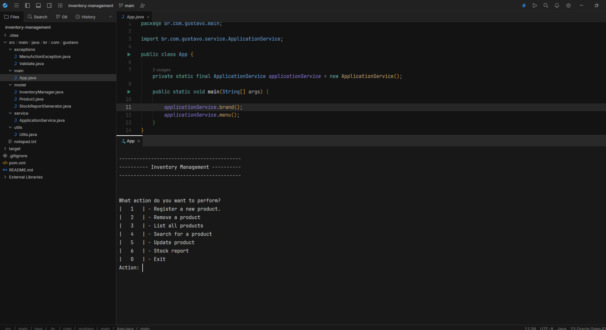

# Inventory Management App

Welcome to the Inventory Management App, a simple console application to manage your product inventory. 

## Features:
- Register Products
- Remove a Products
- List All Products
- Search for a Product
- Update a Product
- Generate Stock Reports

## Project Preview

### How to use:

1. Clone the repository to your local environment.
2. Compile and run the program from the main class 'App'.
3. Navigate through the menu using the number corresponding to the actions you want to perform.

#### Contribution: 
Feel free to contribute with improvements and new features. Fork the repository, create a branch for your changes, and submit a pull request.
